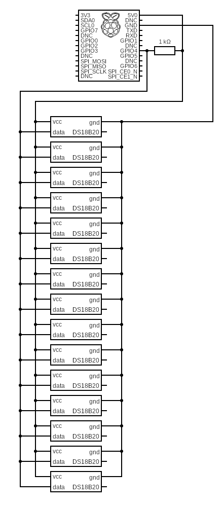

# ThermoPI-Cottage

Use a Raspberry PI connected to one or more temperature sensors to send the results to a MQTT server.

## USAGE

Install the program into opt/ThermoPI-Cottage or any suitable location. (Some people like /usr/local/bin instead of /opt) Make sure the username that is going to be running this script has access to the files and is able to get at python and anything else needed and used here-in.

You will need to rename the file ***MYsecretsSample.yaml*** to ***MYsecrets.yaml***.
Edit the contents of the new ***MYsecrets.yaml*** to match your MQTT & Home Assistant installation and requirements. You will also need to supply the full path to the secrets file in the **Get the parameter file** section of this python code around line 95.

This program grabs the 2nd half of the MAC address to use as the device ID. This only works consistently when there is only 1 Ethernet interface configured or you have your multiple interfaces cloned to the same MAC Address. For instance if it boots from WIFI, it will grab that MAC, and if it uses the Ethernet cable or a USB interface, it will grab that MAC. You get my point. This can be avoided by hard coding the DeviceID with the random and unique number of your choice. Also I have not tested this with IP6 addresses. If you have solutions to any of this, please share.

## AUTO-Start

Here is a good reference on setting up a program to run from systemd. Use it to get familiar with the process.

[How-To Geek on 'Startup With Systemd'](https://www.howtogeek.com/687970/how-to-run-a-linux-program-at-startup-with-systemd/)

To run the program at boot in order to get constant readings, there is the ThermoPICottage.service to run this as a service with load-service.sh there to set it up as a service.

The load-service.sh script will stop and scratch reload the service from the local repository (Once you get all the permissions happy).

The user in the ThermoPICottage.service should match the user that owns the files in the cloned directory and for security reasons should not be root or pi.

The cottRestart.sh is the script to quickly restart the process if needed during troubleshooting. I found it helpful.

## Requirements

Program requirements (as written):  (Feel free to fork it & update the obsolete DHT Libraries to CircuitPython DHT Libraries and dropping me a merge request...)

+ Python 3.6 or better
+ [PyYAML](https://pypi.org/project/PyYAML/) For reading the YAML parameter file
+ [W1ThermSensor](https://github.com/timofurrer/w1thermsensor) For 2 wire temp sensors [(DS18B20)](http://www.d3noob.org/2015/02/raspberry-pi-multiple-temperature.html)
+ [paho-mqtt](https://pypi.org/project/paho-mqtt/) For MQTT broker connection

**If you have any questions, comments or additions be sure to add an issue and bring them up on my Discord Server:**

This is roughly the circuit used with this program:

### Contact Links

+ [Discord WhatAreWeFixingToday](https://discord.gg/Uhmhu3B)
+ [What are we Fixing Today Homepage](https://www.WhatAreWeFixing.Today/)
+ [YouTube Channel Link](https://bit.ly/WhatAreWeFixingTodaysYT)
+ [What are we Fixing Today Facebook page](https://bit.ly/WhatAreWeFixingTodayFB)
+ [What are we Fixing Today Twitter](https://bit.ly/WhatAreWeFixingTodayTW)

### Please help support the channel

+ [Patreon Membership](https://www.patreon.com/WhatAreWeFixingToday)
+ [Buy me Coffee](https://www.buymeacoffee.com/SirGoodenough)
+ [PayPal one-off donation link](https://www.paypal.me/SirGoodenough)

## Disclaimer

⚠️ **DANGER OF ELECTROCUTION** ⚠️

If your device connects to mains electricity (AC power) there is danger of electrocution if not installed properly. If you don't know how to install it, please call an electrician.

#### **Beware:** certain countries prohibit installation without a licensed electrician present

Remember: **SAFETY FIRST**. It is not worth the risk to yourself, your family and your home if you don't know exactly what you are doing. Never tinker or try to flash a device using the serial programming interface while it is connected to MAINS ELECTRICITY (AC power).

We don't take any responsibility nor liability for using this software nor for the installation or any tips, advice, videos, etc. given by any member of this site or any related site.
