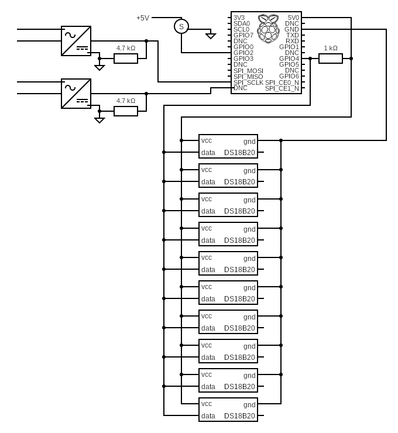

# ThermoPI-Cottage

Use a Raspberry PI connected to ten Dallas 1 wire temperature sensors to send the results to a MQTT server. Also connected is a servo to adjust the temperature setting on the water and 2 GPIO sensors to report the status of the zone thermostats.

## USAGE

Install the program into opt/ThermoPI-Cottage or any suitable location. (Some people like /usr/local/bin instead of /opt) Make sure the username that is going to be running this script has access to the files and is able to get at python and anything else needed and used here-in.

You will need to rename the file ***MYsecretsSample.yaml*** to ***MYsecrets.yaml***.
Edit the contents of the new ***MYsecrets.yaml*** to match your MQTT & Home Assistant installation and requirements. You will also need to supply the full path to the secrets file in the **Get the parameter file** section of this python code around line 90.

You will need to determine the unique serial number of each probe and put that in the parameter file. Here is a good primer on how to find these: [Get the Probe Serial Numbers](https://www.industrialshields.com/blog/raspberry-pi-for-industry-26/post/ii-temperature-sensor-raspberry-plc-how-to-get-the-temperature-316). To figure out which is which, simply use a glass of ice water to cool the probes one by one. Watch the temperature change and mark them. Set-up the parameter file accordingly.

This program grabs the 2nd half of the MAC address to use as the device ID. This only works consistently when there is only 1 Ethernet interface configured or you have your multiple interfaces cloned to the same MAC Address. For instance if it boots from WIFI, it will grab that MAC, and if it uses the Ethernet cable or a USB interface, it will grab that MAC. You get my point. This can be avoided by hard coding the DeviceID with the random and unique number of your choice. Also I have not tested this with IP6 addresses. If you have solutions to any of this, please share.

## SERVO

I have programmed around the servo I decided to buy for this, but certainly other servos can be selected. This [servo](https://www.amazon.com/dp/B083GNMBB6?tag=drzzs0e-20) provides 25kg of force and 270 degrees of travel. I did not know what I needed, so this is what I bought. There are parameters in the yaml file to set the servo direction, the rotation range, the frequency, and the PWM0 value, so a wide range of servo's can be used.

To connect the servo to the temperature control knob, I didn't want to remove the knob or damage it. I wanted it to be completely removable. What I did was take an impression of the knob in some kids playdoh and froze it in some water so it kept it's shape on the travel home. You see the water heater was 300 miles away from my 3D printer and my measuring calipers. I created a shape in TinkerCad that would fit well into the playdoh impression and therefore be the shape of the knob. I then used this knob shape as a 'hole' in TinkerCan and created a structure around it. I then added a couple of holes for heat set inserts and printed it. I then created a mount arm that I modified from Thingiverse and a plate to mount the servo motor to that was big enough to drill and mount to the water heater. I had no idea how that was going to happen, so I just left it open for whatever.

Links to these TinkerCad files are here. Use what you can and modify what you cannot.

[Backplate Motor Mount](https://www.tinkercad.com/things/8xlUXFzqAMQ-water-heater-backplate)

[Servo Arm](https://www.tinkercad.com/things/bKByy3qXluZ-servo-arm-water-heater)

[Water Heater Knob](https://www.tinkercad.com/things/fV5ZxNxaQiI-water-heater-knob)

## THERMOSTAT SENSORS

I was stuck with a 2 zone controller that had 2 zone thermostats connected to it and no real place to 'sense' the state of those thermostats. Modifying the zone controller was not an option. What I decided to do was buy a couple of [AC/DC to DC Buc converters](https://www.amazon.com/dp/B09QCVY43Z?tag=drzzs0e-20). These are connected to the AC side across the thermostat connections. These points will see 24AC when the thermostat in 'open' (no heat) and near 0V when the points are closed (asking for heat). The devices were adjusted to output 5VDC and a 5k resistor was soldered across the output as a pull-down. The result in a 5VDC signal for each thermostat that will be HIGH when the thermostat is not wanting heat and LOW when the thermostat is asking for heat. These are connected between a couple of GPIO's and gnd. The program reports 'ON' when the GPIO is 'LOW' and OFF when the GPIO is 'HIGH'. This also means if the devices are not working, they will report as hot. Unfortunate,but I didn't know a way around it.

## AUTO-Start

Here is a good reference on setting up a program to run from systemd. Use it to get familiar with the process.

[How-To Geek on 'Startup With Systemd'](https://www.howtogeek.com/687970/how-to-run-a-linux-program-at-startup-with-systemd/)

To run the program at boot in order to get constant readings, there is the ThermoPICottage.service to run this as a service with load-service.sh there to set it up as a service.

The load-service.sh script will stop and scratch reload the service from the local repository (Once you get all the permissions happy).

The user in the ThermoPICottage.service should match the user that owns the files in the cloned directory and for security reasons should not be root or pi.

The cottRestart.sh is the script to quickly restart the process if needed during troubleshooting. I found it helpful.

## Requirements

Program requirements (as written):

+ Python 3.6 or better
+ [PyYAML](https://pypi.org/project/PyYAML/) For reading the YAML parameter file
+ [W1ThermSensor](https://github.com/timofurrer/w1thermsensor) For 1/2 wire temp sensors [(DS18B20)](http://www.d3noob.org/2015/02/raspberry-pi-multiple-temperature.html)
+ [paho-mqtt](https://pypi.org/project/paho-mqtt/) For MQTT broker connection

**If you have any questions, comments or additions be sure to add an issue and bring them up on my Discord Server:**

This is roughly the circuit used with this program:

For my install I used this adapter board to connect the probes: 
<https://www.amazon.com/Screw-Terminal-Breakout-Module-Raspberry/dp/B08LH97XCR?tag=drzzs0e-20>

These are the sensors I used:
<https://www.amazon.com/dp/B08W27W7LJ?tag=drzzs0e-20>

These are the JST Connector pigtails I used:
<https://www.amazon.com/HKBAYI-50Pair-50sets-Connector-WS2812B/dp/B00NBSH4CA?tag=drzzs0e-20>

### Contact Links

+ [Discord WhatAreWeFixingToday](https://discord.gg/Uhmhu3B)
+ [What are we Fixing Today Homepage](https://www.WhatAreWeFixing.Today/)
+ [YouTube Channel Link](https://bit.ly/WhatAreWeFixingTodaysYT)
+ [What are we Fixing Today Facebook page](https://bit.ly/WhatAreWeFixingTodayFB)
+ [What are we Fixing Today Twitter](https://bit.ly/WhatAreWeFixingTodayTW)

### Please help support the channel

+ [Patreon Membership](https://www.patreon.com/WhatAreWeFixingToday)
+ [Buy me Coffee](https://www.buymeacoffee.com/SirGoodenough)
+ [PayPal one-off donation link](https://www.paypal.me/SirGoodenough)

## Disclaimer

⚠️ **DANGER OF ELECTROCUTION** ⚠️

If your device connects to mains electricity (AC power) there is danger of electrocution if not installed properly. If you don't know how to install it, please call an electrician.

#### **Beware:** certain countries prohibit installation without a licensed electrician present

Remember: **SAFETY FIRST**. It is not worth the risk to yourself, your family and your home if you don't know exactly what you are doing. Never tinker or try to flash a device using the serial programming interface while it is connected to MAINS ELECTRICITY (AC power).

We don't take any responsibility nor liability for using this software nor for the installation or any tips, advice, videos, etc. given by any member of this site or any related site.
